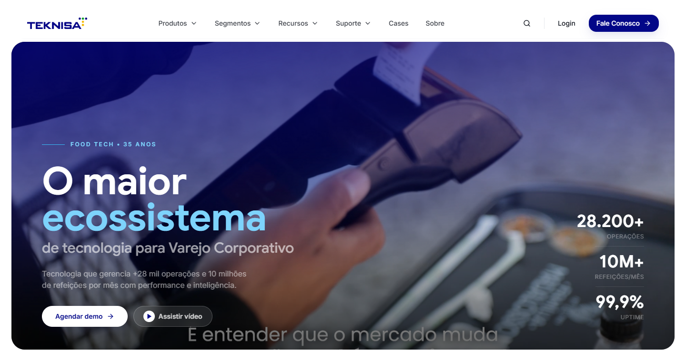

<div align="center">

# Teknisa · Novo Site Institucional

**A inteligência que move a alimentação.**
Do balcão do restaurante ao ERP da indústria, uma plataforma só.

[](https://react.dev)
[](https://vite.dev)
[](https://www.typescriptlang.org)
[](https://tailwindcss.com)
[](https://www.framer.com/motion/)


</div>

Reconstrução do site institucional da **Teknisa** (software house de food service e varejo
corporativo, 35 anos de especialização), migrando do antigo WordPress + Avada para uma SPA moderna
em código. A meta de régua não é "um bom site B2B": é craft de nível Awwwards, na linha de Toast,
Stripe e Linear.

A fonte de verdade de produto, estratégia e direção visual é o
[`teknisa-redesign-blueprint.md`](teknisa-redesign-blueprint.md). O guia operacional para o código
é o [`CLAUDE.md`](CLAUDE.md).



---

## Índice

1. [Visão e conceito](#visão-e-conceito)
2. [Stack](#stack)
3. [Começando](#começando)
4. [Scripts](#scripts)
5. [Estrutura do projeto](#estrutura-do-projeto)
6. [Design system](#design-system)
7. [Arquitetura da home](#arquitetura-da-home)
8. [Convenções de código](#convenções-de-código)
9. [Acessibilidade e performance](#acessibilidade-e-performance)
10. [Roadmap técnico](#roadmap-técnico)
11. [Regras do projeto](#regras-do-projeto)
12. [Licença](#licença)

---

## Visão e conceito

> **"A inteligência que move a alimentação."**
> Do balcão do restaurante ao ERP da indústria, uma plataforma só.

Tudo no site prova essa frase: a especialização de 35 anos, os números que se movem, o ecossistema
integrado, a IA aplicada e o evento próprio (Food Service Show).

- **Posicionamento:** amplitude no portfólio, nicho na narrativa. O "ecossistema" é o guarda-chuva
  (multiproduto), mas a alma food service fica explícita no copy de apoio. É a faca contra a TOTVS:
  especialista, não generalista.
- **Portfólio a comunicar:** TecFood (alimentação coletiva), Retail (bares, restaurantes, fast food,
  delivery), ERP (indústrias), Pessoas e RH / HCM (folha, ponto, eSocial), Facilities
  (terceirizados), além de **IA** como diferencial central.
- **Referências de craft:** Toast, Square, Lightspeed (food tech), Stripe, Linear, Vercel, Ramp
  (B2B SaaS gold standard), com pitadas experienciais de Awwwards/FWA.

---

## Stack

| Camada            | Tecnologia                                                                 |
| ----------------- | -------------------------------------------------------------------------- |
| App               | **React 18** + **Vite 5** + **TypeScript** (SPA)                            |
| Roteamento        | **react-router-dom 6**                                                      |
| Estilo            | **TailwindCSS 3** com design tokens (CSS vars estilo shadcn)               |
| Motion            | **Framer Motion 12** (reveal, hover, layout do mega-menu)                   |
| Smooth scroll     | **Lenis** (desligado sob `prefers-reduced-motion`)                          |
| Ícones            | **lucide-react**                                                            |
| Fontes            | **@fontsource** self-hosted: **Google Sans** (títulos) + **Inter** (corpo) |
| Utilitários       | class-variance-authority, clsx, tailwind-merge (`cn`)                       |
| Qualidade         | ESLint + Prettier                                                          |

> **Build é Vite.** O projeto não usa Next.js nem `next/font`.

---

## Começando

### Pré-requisitos

- **Node.js 18+** e **npm**.

### Instalação

```bash
git clone https://github.com/botelllhx/Projeto-Teknisa-Vision.git
cd Projeto-Teknisa-Vision
npm install
```

### Desenvolvimento

```bash
npm run dev
```

Abre o servidor de desenvolvimento do Vite (por padrão em `http://localhost:5173`).

### Build de produção

```bash
npm run build      # tsc -b --noEmit + build de produção em /dist
npm run preview    # serve o build localmente para conferência
```

---

## Scripts

| Comando            | O que faz                                              |
| ------------------ | ------------------------------------------------------ |
| `npm run dev`      | Servidor de desenvolvimento (Vite, HMR)                |
| `npm run build`    | Checagem de tipos (`tsc -b --noEmit`) + build em `/dist` |
| `npm run preview`  | Serve o build de produção localmente                   |
| `npm run lint`     | ESLint em todo o projeto                                |
| `npm run format`   | Prettier em `src/**`                                   |

---

## Estrutura do projeto

```text
projeto-teknisa-vision/
├─ public/
│  └─ assets/teknisa/         estáticos servidos como root
│     ├─ videos/              vídeo de fundo do hero
│     ├─ segments/<slug>/     fotos dos segmentos (WebP otimizado)
│     ├─ products/<slug>/     logos e telas dos produtos
│     └─ references/          moodboard de referência
├─ raw-assets/                originais (fora do build) das imagens otimizadas
├─ src/
│  ├─ pages/                  rotas (Home, SegmentStub, ProductStub, NotFound)
│  ├─ components/
│  │  ├─ layout/              Navbar, MegaMenu, menuData, Footer
│  │  ├─ sections/            seções da home (Hero, TrustBar, SegmentExplorer, …)
│  │  └─ ui/                  primitivos (button, BentoCard, LogoMarquee, …)
│  ├─ lib/                    utils (cn), motion (easings), useSmoothScroll
│  ├─ styles/                 index.css (tokens + base)
│  ├─ App.tsx                 rotas via react-router + MotionConfig global
│  └─ main.tsx
├─ teknisa-redesign-blueprint.md   fonte de verdade de produto/design
└─ CLAUDE.md                       guia operacional do código
```

---

## Design system

Regra dura de cor: base **branca** (light é o padrão), **azul Teknisa** protagonista dos destaques
(CTAs, ícones, números, headlines) e **texto em preto e azul** (preto no corpo, azul em links,
ênfases e títulos). Seções **dark** apenas pontuais e estratégicas.

### Cor

- **Azul Teknisa (cor de marca real):** `#040486` (HSL `238 97% 27%`), token semântico `--primary`
  (classes `bg-primary`, `text-primary`).
- **Escala `teknisa` 50 a 900** no Tailwind (`text-teknisa-600`, etc.), com a marca em `teknisa-800`.
- Acento ciano pontual usa o `sky` nativo do Tailwind (a palavra cinética "ecossistema" no hero é
  `text-sky-300`).
- **Tokens semânticos via CSS vars** (estilo shadcn) em `src/styles/index.css`: `background`,
  `foreground`, `primary` (+ `light`/`dark`), `secondary`, `muted`, `accent`, `card`, `popover`,
  `border`, `input`, `ring`, `success`, `destructive`. Suportam **dark mode por `class`**.

### Tipografia

- **Títulos:** Google Sans (`font-display`), open source sob OFL, self-hosted via `@fontsource`,
  subset latin, pesos 400 a 700.
- **Corpo:** Inter (`font-sans`).

### Outros tokens

- Radius `2xl` e `3xl`, sombras suaves ancoradas no azul (`shadow-sm` a `shadow-xl`, `shadow-glow`).
- Easing assinatura: `ease-expo-out` (Tailwind) e `EASE` / `EASE_EXPO` / `EASE_SMOOTH` em
  `src/lib/motion.ts`.

> A cor de marca não é inventada: foi extraída do projeto Teknisa Vision. Derive sempre dos tokens.

---

## Arquitetura da home

Espinha narrativa: **autoridade → roteamento → produto tangível → IA → prova → eventos → conversão.**

| #   | Seção                                   | Status         |
| --- | --------------------------------------- | -------------- |
| 0   | Navbar sticky glass + mega-menu         | ✅ pronto      |
| 1   | Hero (ecossistema + métricas + CTAs)    | ✅ pronto      |
| 2   | Barra de confiança (marquee de logos)   | ✅ pronto      |
| 3   | Explorador de segmentos (abas + bento)  | ✅ pronto      |
| 4   | Faixa de impacto / ROI (ponte)          | ✅ pronto      |
| 5   | Ecossistema de produtos                 | ⬜ a definir   |
| 6   | Spotlight de IA (dark)                  | ⬜ placeholder ★ |
| 7   | Deep-dive TecFood (sticky scroll)       | ⬜ placeholder ★ |
| 8   | Casos de sucesso                        | ⬜ placeholder |
| 9   | Integrações (orbital)                   | ⬜ placeholder ★ |
| 10  | Food Service Show (mapa da turnê)       | ⬜ placeholder ★ |
| 11  | Onde nos encontrar (feiras)             | ⬜ placeholder |
| 12  | Por que Teknisa                         | ⬜ placeholder |
| 13  | Prêmios e certificações                 | ⬜ placeholder |
| 14  | Hub de conteúdo                         | ⬜ placeholder |
| 15  | CTA final (form)                        | ⬜ placeholder |
| 16  | Rodapé rico                             | ⬜ mínimo      |

`★` marca os momentos-assinatura (os instantes de "wow" do blueprint).

### Destaques do que já está pronto

- **Navbar e mega-menu:** itens Produtos, Segmentos, Recursos, Suporte, Cases, Sobre, mais busca,
  Login e o CTA Fale Conosco. Taxonomia real (8 grupos de Produtos, 4 de Segmentos) em
  `menuData.ts`. Animação colapsável via grid-rows, glass/blur ao rolar, acessível por teclado.
- **Hero:** headline cinética destacando "ecossistema" sobre vídeo escuro, métricas e CTAs Agendar
  demo / Assistir vídeo.
- **Barra de confiança:** marquee de logos em largura total, loop infinito com pausa no hover.
- **Explorador de segmentos:** seção com abas (uma por segmento), cada uma com layout, tons de azul
  e bento próprios; cards com foto, claim, métrica de setor (com fonte), sub-segmentos e CTA.
- **Faixa de impacto / ROI:** copy curta cujas palavras acendem para o azul ao scroll, e uma faixa
  azul que entra da esquerda para a direita com os números de impacto.

---

## Convenções de código

- **TypeScript estrito.** Alias de import `@/` aponta para `src/`.
- **Componentes** em PascalCase, named exports, um componente por arquivo.
- **Padrão de seção:** cada seção é um `<section id="…">` com `scroll-mt-24`; container via
  `.section-container` (`max-w-7xl` + padding).
- **Padrão de motion:** `whileInView` + `viewport={{ once: true }}` para reveal; contadores via
  IntersectionObserver. O `MotionConfig` global e a rede de segurança CSS respeitam sempre
  `prefers-reduced-motion`.
- **Estilo de texto:** sem rótulos em CAIXA ALTA com letter-spacing largo e **sem travessão** em copy
  (decisões de craft do projeto).

---

## Acessibilidade e performance

- **Acessibilidade (meta WCAG AA):** foco visível, navegação por teclado (mega-menu abre por
  Enter/Espaço, fecha no Esc), `alt` reais, `aria-*` em disclosures e diálogos.
- **Motion responsável:** `prefers-reduced-motion` desliga o smooth scroll (Lenis) e zera animações.
- **Performance (meta LCP < 2,5s, CLS ~0):** imagens em WebP otimizadas, lazy-load abaixo da dobra,
  fontes self-hosted com subset latin.

---

## Roadmap técnico

Previsto, a instalar/configurar na hora certa (não antes):

- **SEO sem SSR (antes do go-live):** prerendering/SSG estático (`vite-react-ssg` ou equivalente) +
  `react-helmet-async` para `<title>`/meta/OpenGraph por rota.
- **Momentos-assinatura:** GSAP/ScrollTrigger e React Three Fiber (WebGL pontual), lazy-loaded.
- **i18n PT/EN/ES** por rota.
- **Camada de IA-readability:** schema.org, `sitemap.xml`, `llms.txt`/`agents.json`.
- **CMS headless** (Sanity/Contentful) ou MDX para blog, cases e eventos.
- **Landings de segmento e de produto** individuais (SEO) após a home.

---

## Regras do projeto

- **Não inventar** números, claims, prêmios ou clientes; validar com o marketing.
- **Não alterar** o conceito do hero e do navbar sem combinar (estão aprovados).
- **Consultar o blueprint a cada nova seção:** ele é a fonte de verdade.
- **Performance e acessibilidade** são requisitos, não opcionais.

---

## Licença

Projeto interno e proprietário da **Teknisa**. Todos os direitos reservados.

<div align="center">

Feito com craft para a Teknisa · _A inteligência que move a alimentação._

</div>
